# puttyU

```
───────────────────────────────────────────────
 ⊹ ࣪ ˖ ૮( ˶ᵔ ᵕ ᵔ˶ )っ  puttyU vers. 1.0
───────────────────────────────────────────────
```

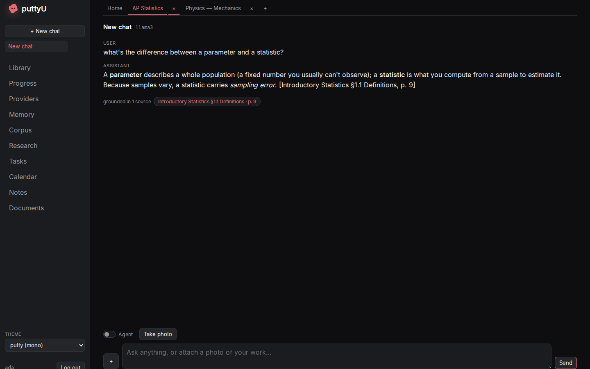

**puttyU** — *"putty university", your patient tutor* — is a self-hosted AI
**tutoring app**. It runs on your own hardware, against your own models and your
own curated library of textbooks and papers, and it builds a private memory of
how *you* learn. Local-first, privacy-first, no trojan.

It is forked from an upstream self-hosted AI workspace (see
[`ACKNOWLEDGMENTS.md`](ACKNOWLEDGMENTS.md)) and is being rebuilt, slice by slice,
into a learning workspace. Single-student in v1; multi-student is a prepared seam.

---

## What it is

Most "AI tutors" are a chat box bolted onto a frontier model. puttyU is built
around three ideas that a plain chat box can't give you:

1. **A library that is the source of truth.** You curate a corpus of textbooks,
   papers, and your own course materials. The tutor grounds its answers in *your*
   sources and **cites the page** — when it can't ground a claim, it says so
   rather than confabulating.
2. **A memory of the student, not the session.** Every study interaction feeds an
   **ensemble knowledge graph** that tracks what you've said, what the tutor has
   observed, and how your mastery of each concept is trending over time —
   bi-temporally, with provenance. The tutor reads this graph before every
   context-bound call, so it adapts to where you actually are.
3. **Focus with peripheral awareness.** Set your course load and the workspace
   organizes into course tabs. When you study Calculus while also taking
   calculus-based Physics, the tutor's context is predominantly calculus but stays
   aware of the coupled course, so it can ground abstract math in something
   tangible from your physics homework.

### The aim

> "A database filled with textbooks, literature, and papers that acts as the
> source of truth. The student logs in, sets their current course load — that
> determines the courses they tab through, and it informs the AI what content to
> pull from and how to help. The platform must be extensible to fit any course.
> A graph-style memory system lets the AI stay flexible about the past and
> current state of the student and adjust its content accordingly."
> — owner's vision, frozen into [`docs/SPEC-phase-2-tutoring-ux.md`](docs/SPEC-phase-2-tutoring-ux.md)

### Product principles (hard rules)

- **Calm, not gamified.** No streaks, XP, leaderboards, or guilt mechanics.
  Mastery progress and momentum are narrative, not score.
- **Reading is the medium.** No TTS/STT — *ever*. Output is text you read; input
  is typed, drawn, or photographed. This is deliberate pedagogy.
- **Nothing untrusted is silently acted on.** Everything the model reads from
  user-supplied or fetched content (uploads, syllabi, pages, notes) is untrusted;
  every write derived from it (calendar events, todos, tags, graph assertions) is
  a **proposal you confirm**, never a silent action.
- **The student is the author.** The tutor assists; it does not do the work for
  you (and it won't moralize or refuse a direct request for a worked answer — it
  frames it pedagogically instead).

---

## How the tutoring loop works

| Stage | What happens | Subsystem |
|---|---|---|
| **Set your courses** | Pick a course load; the workspace becomes a strip of course tabs with onboarding and a per-course landing page. | `routes/course_routes.py`, `web/.../courses` |
| **Curate the library** | Import textbooks/papers (PDF + structured markdown), or upload your own syllabi/homework and **tag** them to steer retrieval. Capture paper documents with the **webcam**. | `src/corpus/`, `routes/corpus_routes.py`, `web/.../library` |
| **Chat, grounded** | The tutor answers from the course's corpus and streams **citation chips** that open the PDF at the exact page. Ungrounded claims are marked honestly. | `src/corpus/grounding.py`, `src/student_context.py`, chat SSE |
| **Build the graph** | After each turn, an extractor distills verbatim observations and tutor insights into the **ensemble graph**; a BKT-lite mastery model updates per concept. | `src/graph/`, weekly consolidation builtin |
| **See your map** | A **Progress** screen renders a state-colored concept tree and a trajectory timeline. You can override the tutor's read or **challenge an insight**. | `routes/graph_routes.py`, `web/.../progress` |
| **Practice (in progress)** | A review queue, the **Gym** (weakness-targeted problem generation), calibration, exam simulation, and explain-it-back. Drawing on REAL corpus problems first, LLM-generated only when the library is dry. | `src/practice/` (T4, partial) |

The right model is chosen per task: a **model router** resolves each call site's
*task profile* (tier `micro|light|standard|deep` + modality + latency + privacy)
against your configured providers — a yes/no check goes to a light local model, a
hard reasoning step can go to Claude — with **no model name hardcoded at any call
site**.

---

## Where the project stands (2026-06-13)

- **Phase 1 — lean core + verifiable React frontend rewrite: DONE.** The legacy
  server-rendered frontend is retired; the new TypeScript/React SPA (`web/`) ships
  every kept screen; cut features are deleted. Spec:
  [`docs/SPEC-phase-1-lean-core.md`](docs/SPEC-phase-1-lean-core.md).
- **Phase 2 — tutoring workspace: IN PROGRESS.** Spec frozen at v1.0 (12 Gherkin
  features). Live status and the detailed remaining slices live in
  **[`docs/PHASE-2-BUILD-PLAN.md`](docs/PHASE-2-BUILD-PLAN.md)** — the source of
  truth for what's built, partial, and next.
  - **Done:** T0 (demolition) · T1 (courses) · T2 (library + grounding + model
    router + materials + webcam) · T3 (ensemble graph + Progress UI).
  - **In progress:** T4 (practice engine — backend scaffolding only).
  - **Next:** T5 (dashboard, todos, schedule miner, persona dial, Cmd-K, cost
    meter) · T6 (worksheet grading depth + canvas workspace).
- **Health (kept green — that IS the work):** backend `pytest -m "not quarantine"`
  → **2188 passed, 1 skipped**; frontend **vitest 145**, **Playwright 25 (+1
  skipped)**; **all six fitness gates pass**; typed OpenAPI contract has no drift.

The full slice-by-slice build log lives in [`docs/archive/`](docs/archive/).

---

## Architecture

puttyU keeps a **Python/FastAPI backend** (a tested, ecosystem-anchored asset —
[ADR 0001](docs/adr/0001-architecture-foundation.md)) and pairs it with a
**TypeScript + React 19 + Vite** frontend built with Bun. Ubuntu Linux only;
single-process, SQLite-first.

### The prime directive: verifiability ([ADR 0002](docs/adr/0002-verifiability-gates.md))

Invariants are **mechanical gates**, never conventions — an agent forgets a
convention across sessions but cannot bypass a failing build. Adding a feature
means adding the test/contract/gate that keeps it honest.

- **Typed OpenAPI client.** `scripts/openapi-export.py` → `bun run gen:api` →
  committed `web/src/api/schema.d.ts`; CI fails on drift. New UI-consumed routes
  ride this real seam via typed `openapi-fetch`.
- **Tests are blocking.** `pytest -m "not quarantine"` in CI; flaky tests get a
  `quarantine` marker (informational), never `continue-on-error`. No screen merges
  without a Playwright critical-flow e2e named after its Gherkin scenario.
- **`tsc --noEmit --strict` + ESLint**, with **zero `any`** in `web/src/api`.
- **Six bash fitness functions** (`.fitness/`, run by `run-all.sh`):

  | Gate | Enforces |
  |---|---|
  | **6a** | File-size ceiling — no god-files; allowlist frozen and non-growing |
  | **6b** | Every UI-consumed route declares a `response_model` |
  | **6c** | No raw `request.json()` in new routes |
  | **6d** | No cross-feature imports into the lean core |
  | **6e** | TypeScript only — **zero JavaScript** (even configs are `.ts`) |
  | **6f** | Graph tables have one door (only `src/graph/`, `src/student_context.py`, `routes/graph_routes.py` may touch them) |

### The "one door" invariants (Phase-2 spine)

Three subsystems each have exactly one entry point — they keep the system
reasoned-about and are (or will be) mechanically enforced:

- **User data → `owner_scoped(query, Model, user)`** (`src/auth_helpers.py`). The
  only sanctioned way to scope a user's rows; the prepared seam for multi-student.
- **Graph tables → `src/graph/` public API** (Gate 6f). Non-graph code reads the
  student model through `src/graph/queries.py` / `src/student_context.py`, never
  raw SQL on graph tables.
- **Model selection → `src/model_router.py`.** Call sites declare a task profile;
  the router resolves it against configured providers. Unconfigured → transparent
  fallback to the legacy `endpoint_resolver` chain (behavior unchanged). Adoption
  is incremental (research + graph extractor today; chat/grading/generation next).

### Backend (`/`)

```
app.py            slim orchestrator: middleware chain (CORS → SecurityHeaders →
                  RequestTimeout(45s) → Auth), routers, lifespan boots MCP +
                  scheduler + bg-monitor; serves the web/dist SPA via StaticFiles
core/             database.py (SQLAlchemy; ad-hoc idempotent startup migrations,
                  no Alembic), auth.py, session_manager.py, middleware.py, atomic_io.py
src/              engines:
  llm_core / endpoint_resolver / model_router        LLM + feature-based routing
  agent_loop / agent_tools / tool_* / mcp_manager    agent + tools + MCP
  memory* / rag* / embeddings / chroma_client        memory + RAG (vector + keyword)
  deep_research / visual_report                      research → cited visual report
  task_scheduler / builtin_actions / event_bus       scheduler + bg actions
  corpus/      the curated library (ADR 0003): records/chunker/models/importers/
               indexer/retriever/course_search/grounding — two-store (SQLite + Chroma)
  graph/       ensemble student-memory graph (ADR 0005): 5 tables, seeding,
               mastery (BKT-lite), after-turn extractor, weekly consolidation, queries
  student_context.py   THE assembler: builds tiered context (profile → focus →
                       periphery → ambient) injected into course-bound chat
  practice/    practice engine — PARTIAL (T4): TTL grading-key store today
routes/           thin HTTP adapters — setup_*_routes(deps) -> APIRouter, wired in
                  app.py. Phase-2: course_routes, corpus_routes, router_routes,
                  graph_routes (all typed, real OpenAPI seam, owner_scoped)
services/         facades over src/ (some sys.modules shims)
```

The ensemble graph is **5 tables** ([ADR 0005](docs/adr/0005-ensemble-graph.md)):
`concept_node`, `entity_node`, `assertion` (bi-temporal), append-only
`mastery_evidence`, and derived `mastery_state`. The corpus is **two-store** —
SQLite for records/chunks, ChromaDB for vectors (degrades to keyword search when
Chroma is absent).

### Frontend (`web/src/`)

```
app/         shell, router, dockable window manager + registry, theme system,
             course tab strip
features/    one folder per screen: auth, chat, sessions, models (incl. Routing),
             memory, corpus, research, tasks, calendar, notes, documents,
             courses, library (incl. PdfViewer), progress
components/  shared kit: Markdown, ConfirmButton (two-step deletes), CameraCapture
             (webcam), toast/Toasts, Spinner
api/         generated schema.d.ts + typed client + streaming.ts (SSE helpers:
             streamChat parses citations + agent control events)
```

React 19 + Vite, `strict` on, **zero JavaScript** at the end state (Gate 6e — new
`.js/.jsx/.mjs/.cjs` fails the build). State: zustand stores; persistence is SQLite
(`data/app.db`), JSON files (`auth.json`, `sessions.json`, `router.json`,
`practice_keys.json`, …), ChromaDB vectors, and the filesystem (`data/corpus/`,
uploads).

### Design identity

Near-monochrome ink `#0e0e10` canvas, panels lift lighter, a single **coral
`#e06c75`** accent. Type is **Inter** (UI) + **Fira Code** (mono), self-hosted in
`web/public/fonts/`. Design tokens live in `web/src/app/shell.css :root`; component
rules use `var(--token)`s so themes re-skin everything. Rules: sentence-case
headings, no emoji-as-UI, no gradients, coral is the only accent. **18 themes**
ship, switched via the theme picker (persisted in `localStorage`).

---

## Quick Start

Defaults work out of the box: clone, run, then configure models/library inside the
app. Only edit `.env` for deployment-level overrides like `APP_BIND`, `APP_PORT`,
`AUTH_ENABLED`, or `DATABASE_URL`.

On first setup, puttyU creates an admin account (`admin` unless
`PUTTYU_ADMIN_USER` is set) and prints a temporary password in the terminal. For
Docker installs the same line is in `docker compose logs puttyu`. Use it for the
first login, then change it in **Settings**.

Contributing? See [CONTRIBUTING.md](CONTRIBUTING.md).

### Docker (recommended)

```bash
git clone https://github.com/Chunt0/PuttyU.git
cd puttyu
cp .env.example .env       # optional, but recommended for explicit defaults
docker compose up -d --build
```

To include optional extras in the image (PDF page rendering, Office/EPUB
extraction; pulls AGPL PyMuPDF), build with
`docker compose build --build-arg INSTALL_OPTIONAL=true` before `up`.

Open `http://localhost:7000` when the containers are healthy. Compose binds the web
UI and the bundled services (ChromaDB, SearXNG, ntfy) to `127.0.0.1` by default. If
the port is taken, set `APP_PORT=7001` and recreate. Set `APP_BIND=0.0.0.0` only
when you intentionally want LAN/reverse-proxy access.

### Native Linux

```bash
git clone https://github.com/Chunt0/PuttyU.git
cd puttyu
python3 -m venv venv
source venv/bin/activate
pip install -r requirements.txt
python setup.py

# build the frontend (Bun); produces web/dist served by the backend
cd web && bun install && bun run build && cd ..

mkdir -p data
python -m uvicorn app:app --host 127.0.0.1 --port 7000
```

Requirements: Ubuntu Linux, Python 3.11+, Bun (for the frontend build). The app
itself is lightweight; serving local models is the heavy part and depends on your
GPU/VRAM, so small hosts can point puttyU at an API or a remote model server
instead. Use `--host 0.0.0.0` only when you intentionally want LAN access.

### Building the library

The tutor is only as good as its corpus. Import the bundled example textbook to
see grounding work end to end:

```bash
python -m src.corpus example-textbook/statistics --no-embed   # SQLite only, fast
python -m src.corpus example-textbook/statistics              # + Chroma embeddings
```

Then upload your own syllabi/homework/PDFs from the **Library** screen and tag
them.

<details>
<summary>Local models, GPU passthrough, and Ollama in Docker</summary>

**Ollama on the host (Docker puttyU).** Add this endpoint in Settings:

```text
http://host.docker.internal:11434/v1
```

Ollama must listen outside its own loopback:

```bash
OLLAMA_HOST=0.0.0.0:11434 ollama serve
```

`host.docker.internal` is Docker's hostname for the host machine from inside the
container. This connects containerized puttyU to an Ollama server already running
on the host; it does not start Ollama in the container.

**Docker GPU passthrough.** CPU-only users can skip this. For NVIDIA,
`scripts/check-docker-gpu.sh` diagnoses passthrough and can optionally install the
host runtime or write `COMPOSE_FILE` to `.env`:

```bash
scripts/check-docker-gpu.sh                          # read-only diagnostic
scripts/check-docker-gpu.sh --print-install-commands # show install commands only
scripts/check-docker-gpu.sh --install-nvidia-toolkit # install toolkit (sudo)
scripts/check-docker-gpu.sh --enable-nvidia-overlay  # write COMPOSE_FILE to .env
```

The app never installs host GPU runtime or edits `.env` automatically; `.env` is
touched only when `--enable-nvidia-overlay` is explicitly passed, and only after
passthrough succeeds. To enable manually:

```bash
COMPOSE_FILE=docker-compose.yml:docker/gpu.nvidia.yml
```

For AMD/ROCm, `scripts/check-docker-amd-gpu.sh` is read-only diagnostic plus a
manual `.env` edit (`COMPOSE_FILE=...:docker/gpu.amd.yml` and `RENDER_GID`). Read
the comments in `docker/gpu.nvidia.yml` / `docker/gpu.amd.yml` before enabling.
Stack-management UIs (Portainer, Coolify, …) that accept only one Compose file can
point at the standalone `docker-compose.gpu-nvidia.yml` / `docker-compose.gpu-amd.yml`.

Verify after enabling:

```bash
docker compose exec puttyu nvidia-smi -L   # NVIDIA
docker compose logs puttyu | grep -E 'ChromaDB|MemoryVectorStore|DEGRADED'
```

> GPU passthrough confirms Docker GPU *access*, not a CUDA/ROCm-enabled
> llama.cpp/vLLM build. Tensors landing on CPU or `Unable to find cudart` are a
> serve-engine build issue, not a passthrough failure.

</details>

---

## Configuration

Most setup is done in-app via **Settings**. Use `.env` for deployment-level
defaults and secrets you want present before first boot.

| Variable | Default | Description |
|---|---|---|
| `LLM_HOST` | `localhost` | Your LLM server (e.g. `llm-host.local:8000`) |
| `LLM_HOSTS` | — | Comma-separated list for model discovery |
| `OPENAI_API_KEY` | — | Optional. Prefer adding providers in-app unless pre-seeding. |
| `SEARXNG_INSTANCE` | `http://localhost:8080` | SearXNG URL (Docker overrides to `http://searxng:8080`) |
| `APP_BIND` | `127.0.0.1` | Docker host bind for the web UI. `0.0.0.0` only for intentional LAN access. |
| `APP_PORT` | `7000` | Docker host port for the web UI |
| `AUTH_ENABLED` | `true` | Enable/disable login |
| `LOCALHOST_BYPASS` | `false` | Dev-only auth bypass for loopback. Keep false for shared deployments. |
| `SECURE_COOKIES` | `false` | True when served through HTTPS at a trusted proxy |
| `DATABASE_URL` | `sqlite:///./data/app.db` | Database connection string |
| `CHROMADB_HOST` | `localhost` | Vector store host (Docker overrides to `chromadb`) |
| `CHROMADB_PORT` | `8100` | Vector store port (Docker overrides to `8000`) |
| `EMBEDDING_URL` | — | OpenAI-compatible embeddings endpoint |

Env vars are `PUTTYU_*`; HTTP headers are `X-PuttyU-*`. The full set is documented
in [`.env.example`](.env.example).

### Optional dependencies

`requirements-optional.txt` unlocks extra features (not installed by default):

| Package | Feature | License |
|---|---|---|
| `PyMuPDF` | PDF page rendering in the side viewer + form-filling | AGPL-3.0 |
| `markitdown` | Office/EPUB → Markdown text extraction | MIT |
| `duckduckgo-search` | DuckDuckGo as a search provider | MIT |

### Built-in MCP servers

puttyU auto-registers a few built-in MCP servers at startup. The npx-based ones
(the Playwright browser server) only start when the package is already cached, so a
fresh install never blocks on a multi-minute download. To enable the browser MCP:

```bash
npx -y @playwright/mcp@latest --version   # installs ~300MB; restart puttyU after
```

---

## Security

puttyU is a self-hosted app with privileged local tools (shell, file access, model
serving, web research, uploads, API tokens). **Treat it like an admin console.**
See [SECURITY.md](SECURITY.md) and [THREAT_MODEL.md](THREAT_MODEL.md) for the full
trust boundary.

- Keep `AUTH_ENABLED=true` and `LOCALHOST_BYPASS=false` for any network-accessible
  deployment; use `SECURE_COOKIES=true` behind HTTPS.
- Do not expose puttyU directly to the public internet. Terminate HTTPS at a
  trusted reverse proxy or private access gateway (Cloudflare Access, Tailscale,
  Caddy, nginx, Traefik) and proxy to `http://127.0.0.1:7000`.
- Keep ChromaDB, SearXNG, ntfy, Ollama, vLLM/llama.cpp, databases, and raw
  model/provider APIs internal-only. Expose only the authenticated puttyU
  web/API entrypoint.
- Non-admin users get no shell/Python/file access by default; admin-only routes
  (MCP, API tokens, webhooks, model serving, settings) are admin-gated. Review
  each user's privileges before exposing a deployment.
- Keep `.env`, `data/`, `logs/`, databases, uploads, and tokens out of Git (ignored
  by default). Before publishing a fork, run `git status --short` and confirm no
  private files are staged. Rotate any key ever pasted into a chat, demo, or log.

Common internal-only ports: `7000` puttyU · `8080` SearXNG · `8091` ntfy · `8100`
ChromaDB · `11434` Ollama · `8000-8020` common local model APIs.

<details>
<summary>HTTPS for LAN / Tailscale, and the chromadb-client gotcha</summary>

**HTTPS on a LAN/Tailscale.** Set `APP_BIND=0.0.0.0`, generate a locally-trusted
cert with [mkcert](https://github.com/FiloSottile/mkcert), then:

```bash
mkcert -install
mkcert -cert-file cert.pem -key-file key.pem 192.168.1.100 your-tailscale-ip
python -m uvicorn app:app --host 0.0.0.0 --port 7000 \
  --ssl-certfile=cert.pem --ssl-keyfile=key.pem
```

Install the mkcert CA on any device you access puttyU from.

**`chromadb-client` conflict.** If the lightweight HTTP-only `chromadb-client` is
installed alongside the full `chromadb`, vectors silently fall back to HTTP-only
mode and fail. Fix:

```bash
./venv/bin/pip uninstall chromadb-client -y
./venv/bin/pip install --force-reinstall chromadb
```

</details>

---

## Screenshots

The tutoring workspace (Phase 2): course tabs, a grounded library, and the student
graph. (Captured against a mock backend by `web/e2e/snapshots.spec.ts` —
`SNAPSHOTS=1 bunx playwright test snapshots`.)

### The course landing — your map of one course
Course tabs across the top; a mastery strip in the tutor's own four-state
vocabulary (no fake percentages); your own uploaded, tagged materials beside the
shared library.

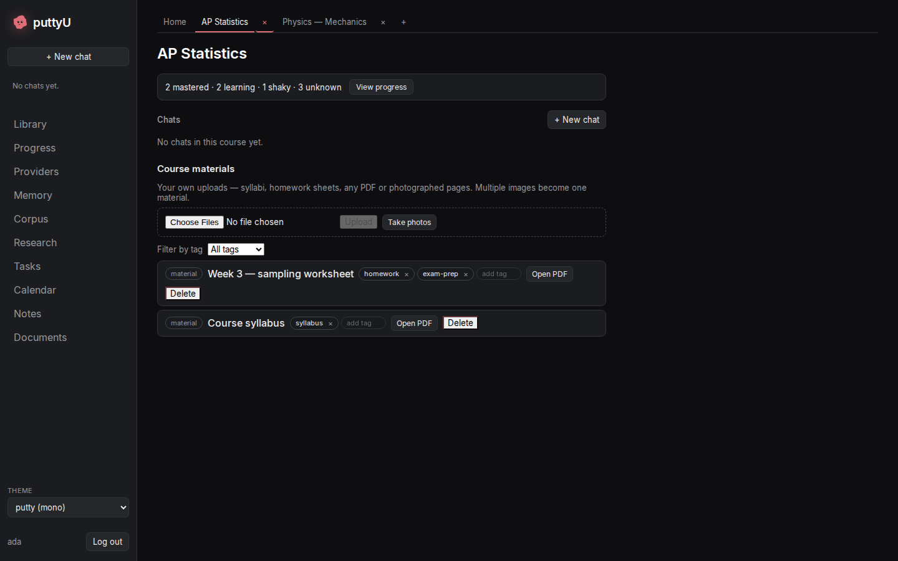

### Grounded chat — answers that cite the source
A `citations` event streams before the tokens; the reply carries a "grounded in N
sources" chip that opens the source PDF at the exact page. Ungrounded claims are
marked honestly.


### The library — your source of truth
Import textbooks and papers; browse a real table of contents; one click opens the
PDF at the page. Your syllabi/homework live beside it as tagged materials.

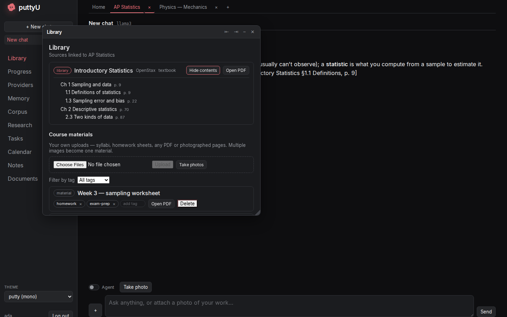

### Progress — the student graph
A state-colored concept tree (mastered / learning / shaky / unknown) with evidence
counts — never a score.

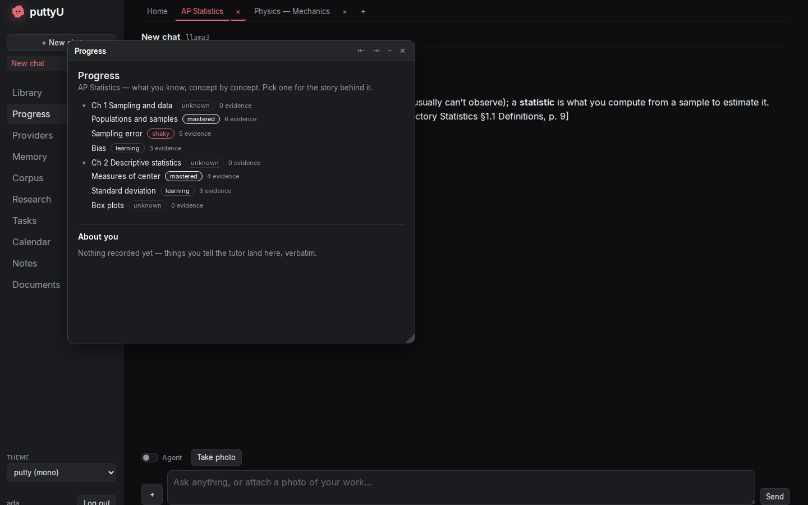

### A concept's trajectory — bi-temporal memory with provenance
Open a concept to read its history: what you *said* (verbatim), what the tutor
*inferred* (with a confidence marker), and superseded insights kept visible but
struck through. You can challenge an insight or override the mastery state.

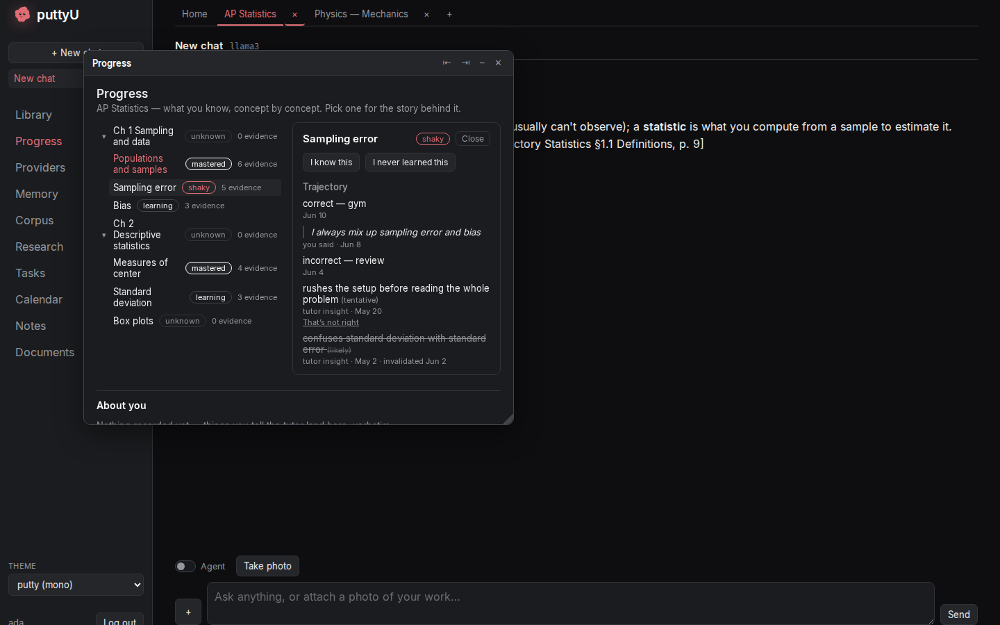

<details>
<summary>The workspace screens (chat, windows, calendar, memory, providers, themes)</summary>

### Chat — markdown, tables, highlighted code
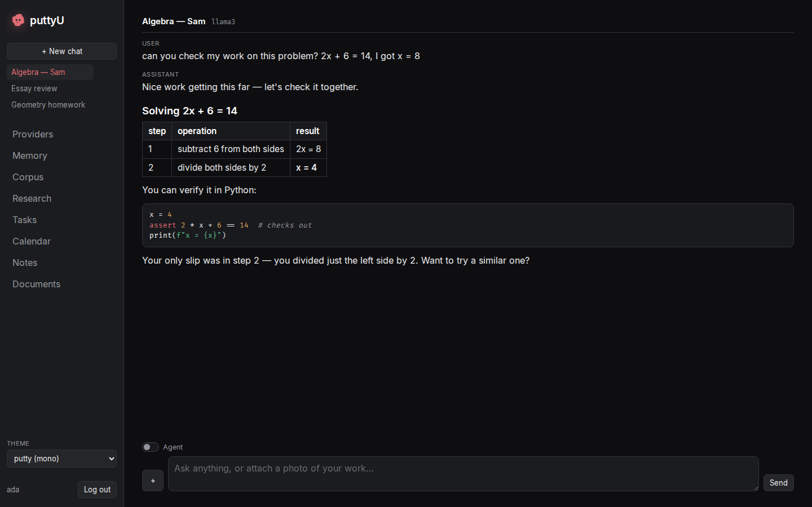

### Agent mode — tool steps
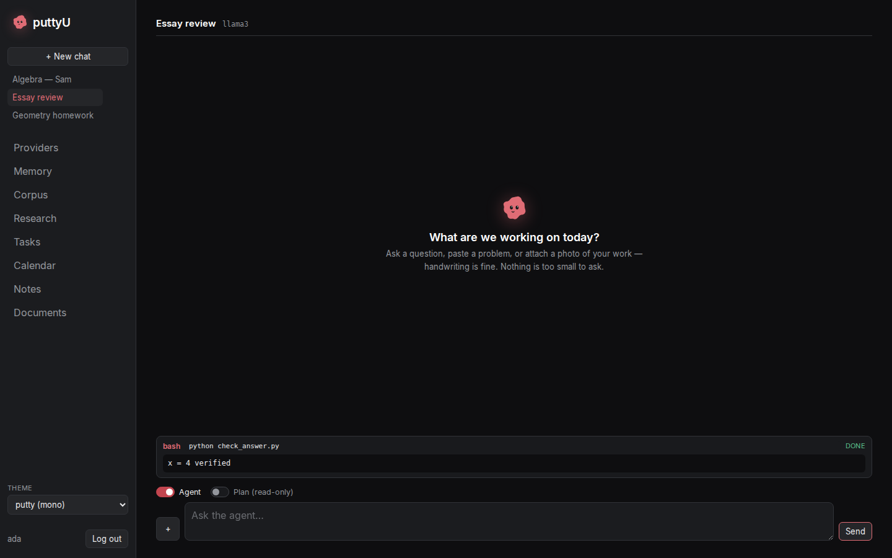

### Window manager
Tools open as floating windows over the live chat; drag to an edge to dock.

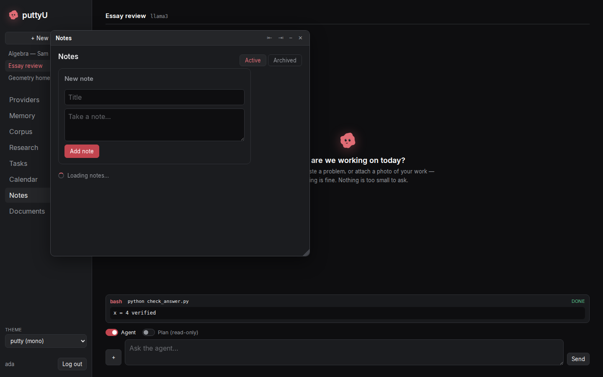
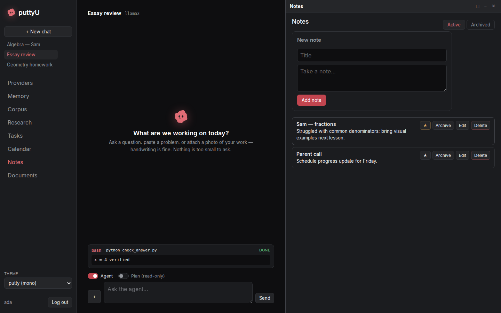

### Documents
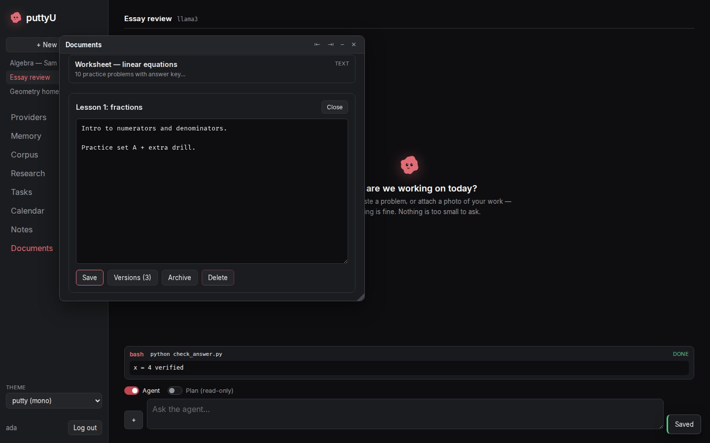

### Calendar
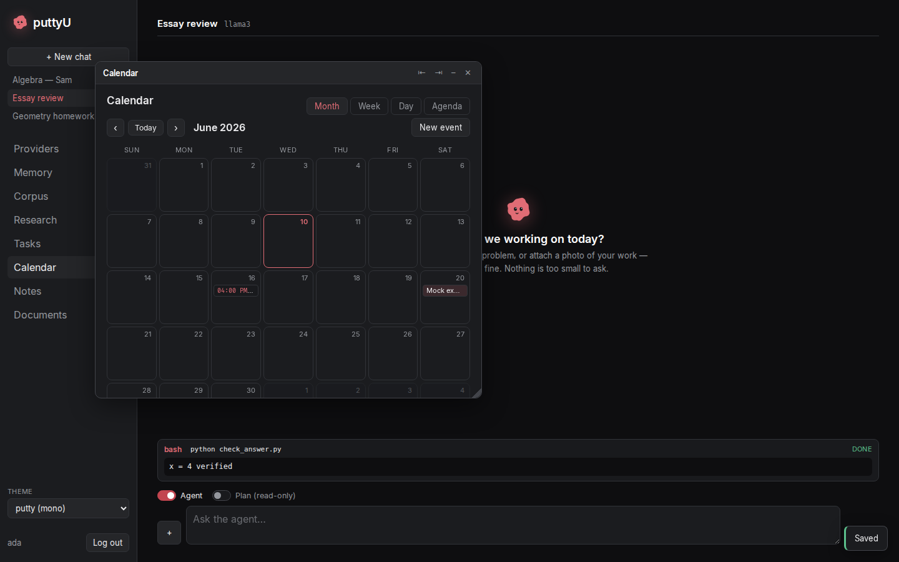

### Memory
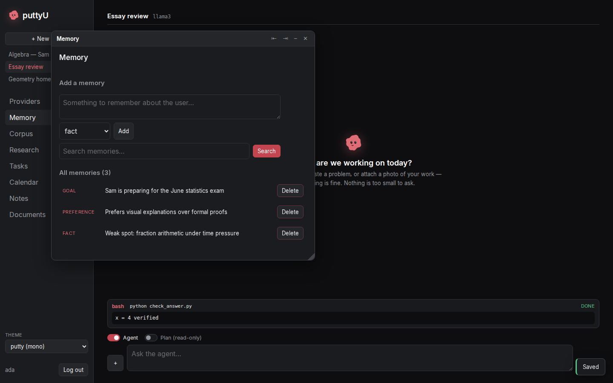

### Providers
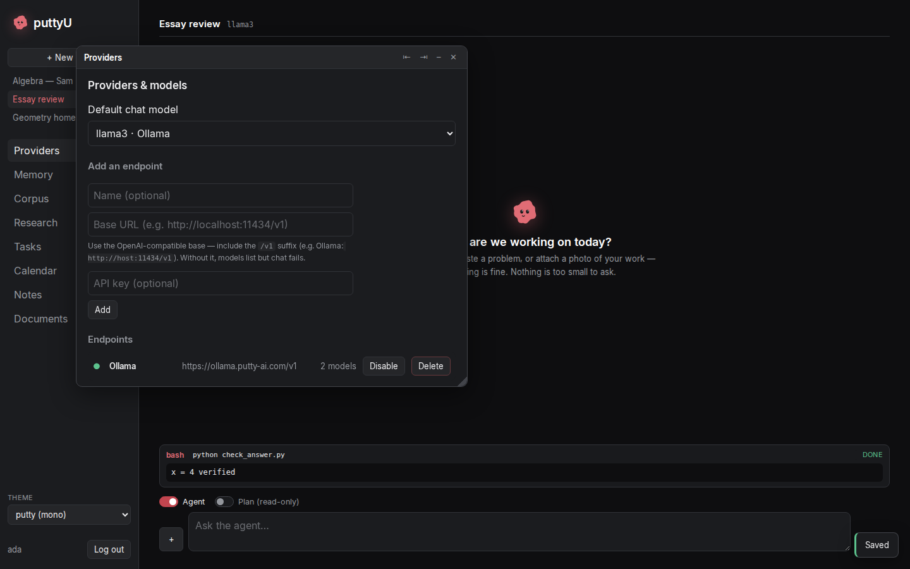

### Themes
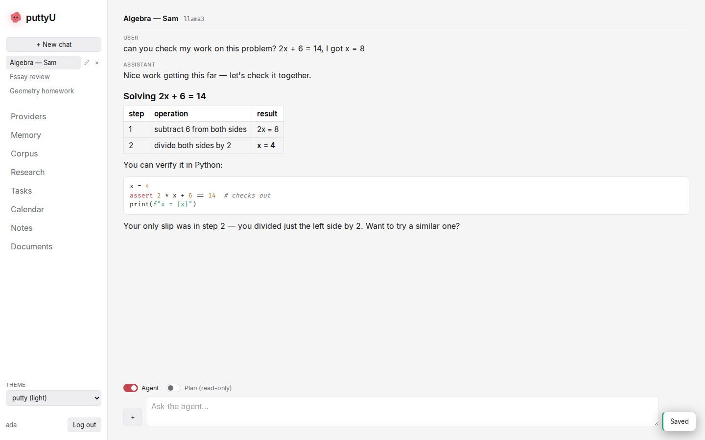
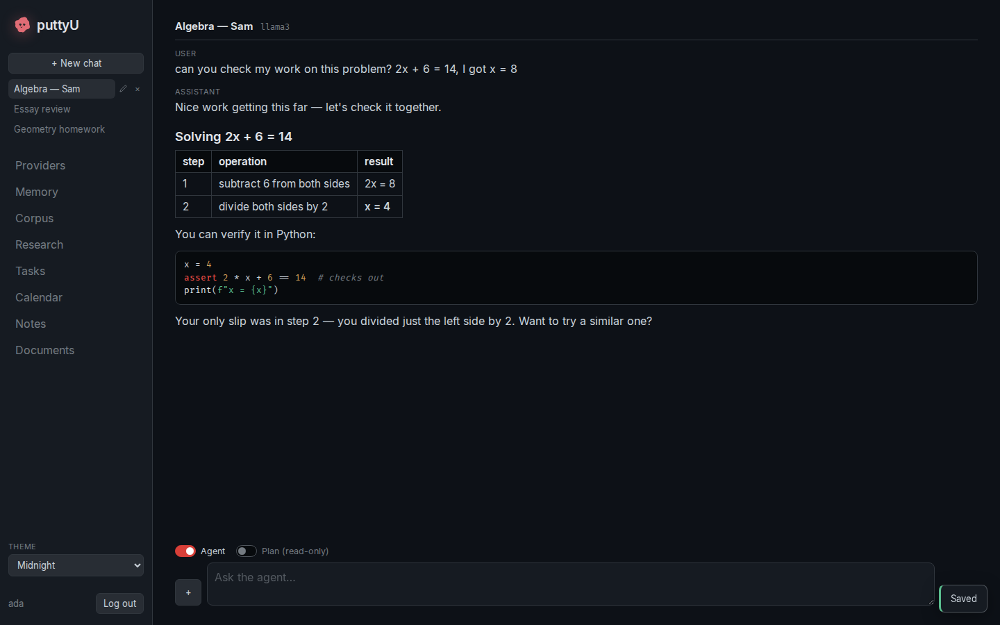

</details>

---

## Testing

```bash
# backend (data/ must exist)
mkdir -p data && .venv/bin/python -m pytest -q -m "not quarantine"

# frontend
cd web && bunx tsc --noEmit && bun run lint && bun run test && bun run e2e

# all fitness gates
bash .fitness/run-all.sh

# regenerate the typed contract after any UI-consumed route change
python scripts/openapi-export.py && cd web && bun run gen:api
```

---

## Contributing

Help is welcome — see [ROADMAP.md](ROADMAP.md) for the current help-wanted list and
[CONTRIBUTING.md](CONTRIBUTING.md) for setup, the branch model, testing, and the
visual style rules. The best entry points are fresh-install testing, grounding/
citation quality, provider setup, and the Phase-2 slices in the build plan.

## License

MIT — see [LICENSE](LICENSE) and [ACKNOWLEDGMENTS.md](ACKNOWLEDGMENTS.md).
</content>
</invoke>
